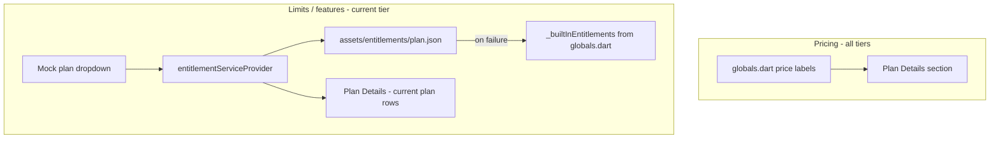
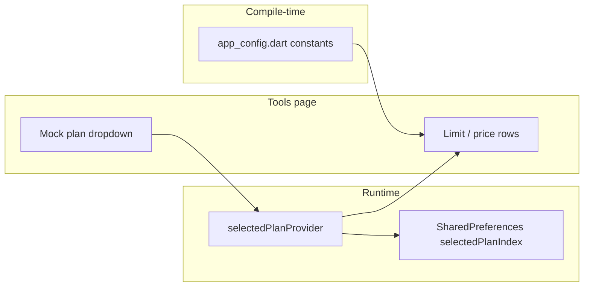

# STG apps - Tools page licensing information sources

**Date:** 2026-06-07 
**Scope:** Where Tools -> **Licensing Control** (or equivalent) gets its data across `stg_*` Flutter apps.

---

## Summary

The licensing UI on **Tools** was **not** one shared implementation in `stg_baseapp`. It lived in **product apps** that model commercial tiers. In every case examined, the dropdown chose a **mock entitlement profile** for development and testing - **not** a live Apple, Google, or Microsoft Store license.

| App | Tools licensing UI | Data source |
|-----|-------------------|-------------|
| `stg_checklist` | Full dropdown + limit table | `SharedPreferences` + `lib/core/config/app_config.dart` |
| `stg_taskapp` | Full dropdown + limit table (admin only) | `SharedPreferences` + `lib/core/config/app_config.dart` |
| `stg_dms` | Licensing dropdowns + **Plan Details** (pricing & limits) | Pricing: `lib/globals.dart`; limits/features: `assets/entitlements/*.json` (+ `globals.dart` fallback) |
| `stg_project` | Static placeholder text only | No plan data wired |
| `stg_baseapp` | None | - |
| `stg_health` | None | - |
| `stg_file_catalog` | None | - |

---

## What the UI looked like

On apps that shipped it, Tools included an expandable section:

- **Section id:** `licensing` (via `StgToolsExpansionGroup` from `stg_theme`)
- **Title:** "Licensing Control"
- **Dropdown label:** "Mock plan profile"
- **Typical tiers:** Trial / Standard / Premium (DMS: free / standard / pro, canonical `planId`: `free`, `standard`, `pro`)

Selecting a tier updated the **effective plan** shown in the section and (where implemented) drove reports or entitlement comparisons. Enforcement in production was **not** fully wired in most apps - display and mock testing were the primary goals.

---

## `stg_checklist`

### UI

- **File:** `stg_checklist/lib/features/tools/tools_page.dart`
- **Section:** `StgToolsExpansionGroup(sectionId: 'licensing', title: 'Licensing Control', ...)`
- **Dropdown:** `DropdownButtonFormField<PlanId>` with label "Mock plan profile"

### Selected tier (runtime state)

| Item | Location |
|------|----------|
| Enum | `PlanId { trial, standard, premium }` in `lib/features/plans/data/plan_provider.dart` |
| Provider | `selectedPlanProvider` (`NotifierProvider<PlanNotifier, PlanId>`) |
| Persistence | `SharedPreferences` key `selectedPlanIndex` (stores `plan.index`) |
| Display names | `planDisplayName()` in same file -> Trial / Standard / Premium |

### Limits, prices, and feature flags (compile-time)

All values shown in the Licensing section (`_priceForPlan`, `_limitForPlan`, `_boolForPlan` in `tools_page.dart`) map to **constants** in:

- **Primary:** `stg_checklist/lib/core/config/app_config.dart`

Examples:

- `stgChecklistTrialPlanPriceLabel`, `stgChecklistStandardPlanPriceLabel`, ...
- `stgChecklistTrialMaxActivePlans`, `stgChecklistStandardMaxTaskGroupsPerPlan`, ...
- `stgChecklistTrialBackupEnabled`, `stgChecklistStandardAllowDependencyGraph`, ...

**Historical note:** These constants originally lived in `lib/globals.dart`. They were split into `lib/core/config/` (and related `core/` modules); `globals.dart` became a deprecated export barrel. See `docs/2026-05-17_completed_work.md` and `docs/stg_checklist_plan_entitlements_proposal.md`.

### Other consumers of the mock tier

- **Home:** `lib/features/home/home_page.dart` - "Current Plan - ..."
- **Reports:** Entitlements vs usage report uses `selectedPlanProvider` in `lib/features/reports/checklist_report_builders.dart` and `reports_page.dart`

### Related documentation

- `stg_checklist/docs/stg_checklist_plan_entitlements_proposal.md`
- `stg_checklist/docs/2026-05-10_afternoon_work_completed.md` (dropdown reset behavior during beta)
- `stg_checklist/docs/PRD_v1.md` (Tools licensing described as mock tiers)

---

## `stg_taskapp`

### UI

- **File:** `stg_taskapp/lib/features/tools/tools_page.dart`
- **Visibility:** Licensing section shown when user is **admin** (`if (isAdmin)`)
- Same `StgToolsExpansionGroup` + "Mock plan profile" dropdown pattern as checklist

### Selected tier

| Item | Location |
|------|----------|
| Provider | `stg_taskapp/lib/features/plans/data/plan_provider.dart` - `selectedPlanProvider` |
| Persistence | `SharedPreferences` key `selectedPlanIndex` |

### Limits and prices

| Item | Location |
|------|----------|
| Prices & numeric caps | `stg_taskapp/lib/core/config/app_config.dart` |
| Plan limit helpers | `stg_taskapp/lib/core/config/plan_limits.dart` |

Example constants: `stgTaskappTrialMaxActiveTasks`, `stgTaskappStandardPlanPriceLabel`, `stgTaskappPremiumPrioritySupport`, etc.

`app_config.dart` header comment: *"Mock plan pricing and entitlements for Tools -> Licensing Control."*

---

## `stg_dms` (STGDMS)

DMS has the richest licensing tooling and was designed for a future backend. Unlike checklist/taskapp, DMS splits **pricing display** and **entitlement limits** across two mechanisms.

### UI (two expandable sections on Tools)

- **File:** `stg_dms/lib/features/tools/tools_hub_page.dart`

#### 1. "DMS - Licensing"

Controls which mock license profile is active:

1. **License source** dropdown - `localMock` vs `backend (placeholder)`
2. **Mock plan profile** dropdown - free / standard / pro (Trial / Standard / Premium; enabled only when source is `localMock`)

Shows **effective plan** only (name + canonical `planId`), not full pricing table.

#### 2. "Plan Details" (pricing + current-tier limits)

This is the section that shows **Trial / Standard / Premium pricing** and the **limits/features for the currently selected plan**.

**Pricing rows (all three tiers, always visible):**

| UI label | Constant | Source file |
|----------|----------|-------------|
| Trial Price | `stgTrialPlanPriceLabel` -> `$0` | `stg_dms/lib/globals.dart` |
| Standard Price | `stgStandardPlanPriceLabel` -> `$9.99/month or $99.00/year` | same |
| Premium Price | `stgPremiumPlanPriceLabel` -> `$24.99/month or $249.00/year` | same |

Underlying numeric constants (not shown directly in UI, but defined alongside labels):

- `stgTrialPlanMonthlyPrice` / `stgTrialPlanYearlyPrice` - `0.00`
- `stgStandardPlanMonthlyPrice` / `stgStandardPlanYearlyPrice` - `9.99` / `99.00`
- `stgPremiumPlanMonthlyPrice` / `stgPremiumPlanYearlyPrice` - `24.99` / `249.00`

Comment in `globals.dart`: *"Plan Pricing (UI display baseline)"* - tier names map to `planId` **free** (Trial), **standard**, **pro** (Premium).

**Limits and feature flags (for the *current* effective plan only):**

Rendered from `entitlementState.current` (Riverpod), e.g. Locations, Filing Cabinets, Drawers, Documents (total), OCR Batch Docs, Advanced Rename Templates, etc. These values come from the entitlement pipeline below - **not** from the price label constants.

### Service and state

| Item | Location |
|------|----------|
| Provider | `stg_dms/lib/features/entitlements/entitlement_service.dart` - `entitlementServiceProvider` |
| Models | `stg_dms/lib/features/entitlements/entitlement_models.dart` - `LicenseSource`, `PlanId`, `EntitlementSet` |
| Enforcement helper | `stg_dms/lib/features/entitlements/plan_guard.dart` |

### Where entitlement limits/features are loaded

**When `LicenseSource.localMock`:**

1. **Primary:** Bundled JSON under `stg_dms/assets/entitlements/`:
 - `free.json` (`planId`: `free`)
 - `standard.json` (`planId`: `standard`)
 - `pro.json` (`planId`: `pro`)

 JSON contains `limits` and `features` only - **no price fields**.

2. **Fallback:** `_builtInEntitlements` map at the bottom of `entitlement_service.dart`, built from **`globals.dart` entitlement constants** (e.g. `stgTrialMaxLocations`, `stgStandardMaxDocumentsTotal`, `stgPremiumAutomationRules`, ...) if asset load/parse fails.

3. **Cache:** Last resolved entitlement JSON in `SharedPreferences` (`entitlement.lastKnownJson`).

**When `LicenseSource.backend`:**

- Placeholder - service falls back to built-in free tier until a real license API is integrated.

**Persistence keys (SharedPreferences):**

- `entitlement.licenseSource`
- `entitlement.mockPlan`

### Important: two baselines can diverge

`globals.dart` defines **both** price labels and a full set of entitlement constants. The bundled JSON files are the **preferred** runtime source for limits/features when `localMock` loads successfully. Those JSON values can differ slightly from the `globals.dart` baseline (for example, `standard.json` may list different cabinet/drawer caps than `stgStandardMaxFilingCabinets` in `globals.dart`). **Pricing always comes from `globals.dart`** in Plan Details; **enforced/displayed limits** follow JSON -> cache -> `_builtInEntitlements` chain.

### DMS data flow (Plan Details)

### Related documentation

- `stg_dms/docs/licensing-policy.md`
- `stg_dms/docs/entitlement-spec.md`
- `stg_dms/docs/sku-mapping.md` (store SKU ↔ `planId` mapping; separate from Tools display constants)
- `stg_dms/docs/App Store and Licensing Rollout Plan.md`
- `stg_dms/docs/phase-1-nonstore-test-plan.md`

---

## `stg_project`

- **File:** `stg_project/lib/features/tools/tools_page.dart`
- **Section:** "Licensing Control" with **static text only** - no dropdown, no plan constants
- Copy states trial-style local use; commercial plan controls not wired
- `lib/core/constants/app_const.dart` has `license = 'BSD 3-Clause License'` for **open-source** attribution (About page), unrelated to Tools mock tiers

---

## Apps without Tools licensing UI

### `stg_baseapp`

- **File:** `stg_baseapp/lib/features/tools/tools_page.dart`
- Only **Miscellaneous** expansion (backup retention, ops log, debug, STG build tools, etc.)
- Program decision (`docs/2026-05-17_STG_UI_program_decisions.md`): product forks add Licensing above Miscellaneous; baseapp shell does not ship it by default

### `stg_health`, `stg_file_catalog`

No Licensing section found in Tools at time of this audit.

---

## Architecture pattern (checklist / taskapp)

**DMS variant:** dropdown -> `entitlementServiceProvider` -> load `assets/entitlements/{plan}.json` (or `_builtInEntitlements` from `globals.dart`) -> cache in SharedPreferences. **Pricing** in Plan Details is a separate read from `globals.dart` price label constants (not from JSON).

---

## What this is *not*

- **Not** Flutter's open-source package license viewer (`showLicensePage` / `LicenseRegistry`)
- **Not** Microsoft Store / Google Play / App Store license verification (except DMS backend placeholder for future work)
- **Not** a shared `stg_theme` or `stg_baseapp` provider - each product app owns its plan constants and provider

For store rollout and anti-abuse design (separate from Tools mock UI), see:

- `stg_baseapp/docs/2026-06-04_STG_app_store_trial_and_licensing.md`

---

## Restoring or porting licensing to a new app

1. Add `StgToolsExpansionGroup(sectionId: 'licensing', ...)` on Tools page
2. Define `PlanId` enum + `selectedPlanProvider` (or DMS-style `entitlementServiceProvider`)
3. Put tier caps and prices in `lib/core/config/app_config.dart` (or JSON assets for DMS-style)
4. Map `PlanId` -> constants in Tools helpers (`_priceForPlan`, `_limitForPlan`, `_boolForPlan`)
5. Optionally wire reports or guards to the same provider when enforcing limits

---

## Key file index

| App | Tools UI | Plan state | Config / assets |
|-----|----------|------------|-----------------|
| checklist | `lib/features/tools/tools_page.dart` | `lib/features/plans/data/plan_provider.dart` | `lib/core/config/app_config.dart` |
| taskapp | `lib/features/tools/tools_page.dart` | `lib/features/plans/data/plan_provider.dart` | `lib/core/config/app_config.dart`, `plan_limits.dart` |
| dms | `lib/features/tools/tools_hub_page.dart` | `lib/features/entitlements/entitlement_service.dart` | **Pricing:** `lib/globals.dart`; **limits:** `assets/entitlements/*.json` + `globals.dart` fallback |
| project | `lib/features/tools/tools_page.dart` | - | - |
| baseapp | `lib/features/tools/tools_page.dart` | - | - |

---

*Generated from codebase audit - 2026-06-07. Updated with STGDMS Plan Details pricing sources.*
