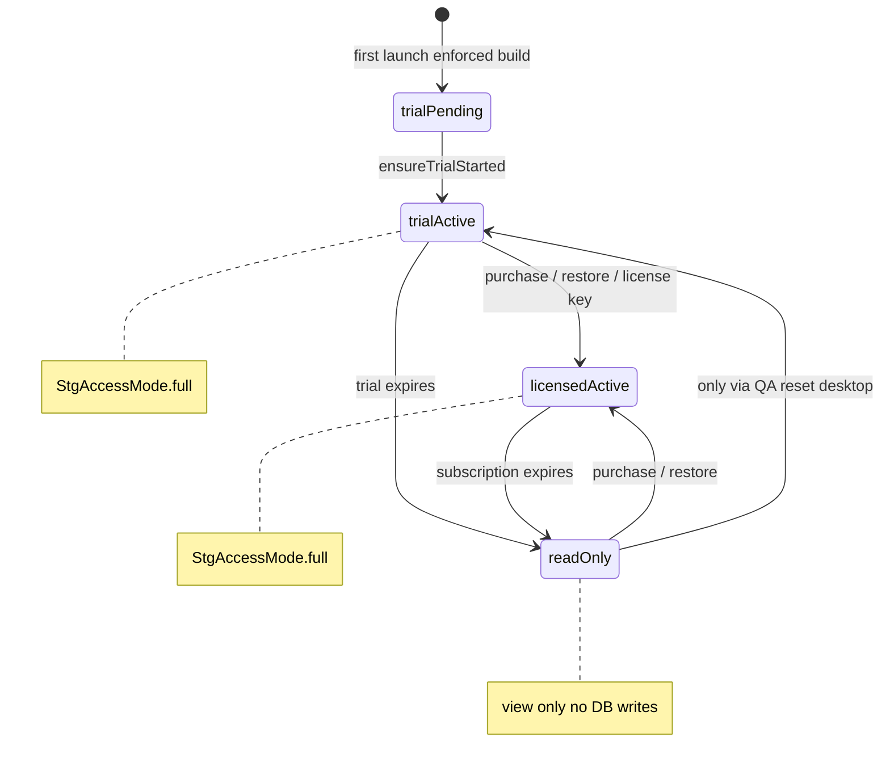

# Portfolio trial, annual subscription, and read-only expiry — implementation plan

**Audience:** STG portfolio engineering and product  
**Status:** Recommendation — design for review before coding  
**Last updated:** 2026-07-10 (decisions updated)  
**Scope:** `stg_health`, `stg_checklist`, `stg_taskapp`, `stg_project`, `stg_property_inventory`, `stg_focus`, and aligned portfolio apps  

### Confirmed decisions (2026-07-10)

| Decision | Value |
|----------|-------|
| **`stg_focus` location** | `D:\0-SoftwareDevelopment\flutter\stg_focus` — add `StgPortfolioAppId.focus` in Phase 1 (`com.safartechgroup.stg_focus`) |
| **Trial length** | **14 days** portfolio-wide (`StgPortfolioPricing.trialDays`) |
| **Trial tier** | **Premium-equivalent** feature access during trial; Standard/Premium enforced only after purchase |

**Still open:** read-only export policy (§2.4), annual-only pricing copy cleanup (§2.6), account/restore mapping (§2.5).

**Source docs parsed:**

| Document | Role |
|----------|------|
| `annual_subscriptions_deployment_guide.md` | Store SKUs, RevenueCat mapping, deployment |
| `revenuecat_portfolio_implementation_guide.md` | Canonical architecture: RC = billing, `stg_licensing` = control |
| `7_day_single_device_trial_architecture.md` | Tamper-resistant trial (desktop / optional hardening) |
| `2026-06-07_stg_health_pricing_analysis.md` | Soft landing: read-only after trial (not yet built) |
| `2026-06-07_stg_tools_licensing_sources.md` | Per-app mock-plan Tools UI (to be replaced / bridged) |

---

## 1. Product requirements (your brief)

| Requirement | Interpretation for implementation |
|-------------|-----------------------------------|
| **Install = trial** | First launch starts a **14-day**, **Premium-equivalent** full-access trial per app (no separate “trial SKU” purchase). |
| **Subscribe during or after trial** | Paywall available while trial is active and when access would otherwise downgrade. |
| **Annual subscriptions only** | Store products and UI show **yearly** Standard and/or Premium per app; no monthly SKUs in portfolio pricing or consoles. |
| **Non-renewal → read-only** | When trial ends **and** no active yearly subscription: user **may view** existing local data; **no creates, updates, or deletes** to the app database. |
| **Portfolio** | Same **patterns** in `packages/licensing`; each app wires repositories and feature gates locally. |

### Explicit non-goals (this phase)

- Portfolio-wide “one subscription unlocks all apps” bundle (per-app subscriptions remain; see §18 in RevenueCat guide).
- Cloud entitlement server (optional Phase 5+; start with RevenueCat + local cache).
- Replacing per-app **Premium vs Standard feature matrices** — those remain; read-only applies when **no paid access at all**.

---

## 2. Open questions (resolve before Phase 1 coding)

### 2.1 ~~`stg_focus`~~ — **confirmed**

**Repo:** `D:\0-SoftwareDevelopment\flutter\stg_focus`  
**Android applicationId:** `com.safartechgroup.stg_focus`  
**Package work (Phase 1):** Add `StgPortfolioAppId.focus` with prefs prefix `stg_focus`, display name **STG Focus**, and pricing row in `stg_portfolio_pricing.dart` (align with health: Standard $59.99/yr, Premium $99.99/yr per `2026-06-07_stg_health_pricing_analysis.md`). Wire licensing in Phase 3 rollout wave with other portfolio apps.

### 2.2 ~~Trial length~~ — **confirmed: 14 days**

Use **14 days** everywhere: `StgPortfolioPricing`, paywall copy, store intro-offer metadata, and tests. Retire 10-day references in older docs when touched.

### 2.3 ~~Trial tier~~ — **confirmed: Premium-equivalent**

During `trialActive`, each app’s `resolveEffectivePlan()` (or equivalent) returns **Premium** for feature gates. After purchase, tier comes from RevenueCat entitlement, license key, or Standard/Premium SKU. Trial does **not** downgrade to Standard mid-trial.

### 2.4 Read-only: exports and backup

Your brief: **no DB writes**. Pricing analysis also suggested **one PDF export** after trial.

**Recommendation (default):** Read-only allows **view + navigate + settings/subscribe**; **blocks all mutating DB operations**; optionally allow **one export per 30 days** on read-only (product decision). State clearly in paywall copy.

### 2.5 Account / login for restore

Yearly subscriptions require **Restore purchases** (Apple) and cross-device entitlement.

**Recommendation:** Tie RevenueCat `Purchases.logIn` to existing STG user id when logged in; anonymous RC user until login. Document in each app’s bootstrap.

### 2.6 Monthly price strings in `stg_portfolio_pricing.dart`

Checklist and taskapp labels still mention monthly prices.

**Recommendation:** Update to **annual-only** labels and store SKUs as part of this initiative (aligns with your store strategy and prior stg_health doc cleanup).

---

## 3. Current state vs target

### 3.1 What exists today (`stg_licensing`)

| Capability | Status |
|------------|--------|
| Trial clock in SharedPreferences | ✅ `trial_started_at_ms`, per-app prefix |
| Trial only when `STG_TRIAL_BUILD=true` | ⚠️ Production store builds skip enforcement |
| License key (Premium, desktop QA) | ✅ |
| Phases: `trialActive`, `licensedActive`, `locked` | ✅ |
| Full **lockout** on expiry (`/trial-expired`) | ✅ in **stg_health** only |
| **Read-only** after expiry | ❌ Not implemented |
| RevenueCat / store purchase | ❌ Documented only |
| `STG_LICENSING_ENFORCED` | ❌ Not implemented |
| Portfolio app wiring | ⚠️ **stg_health** only; others use mock Tools dropdown |

### 3.2 Gap vs your requirements

```
Today:     trial expires → locked → entire app blocked
Target:    trial expires → readOnly → view data, no DB writes, paywall for subscribe
           subscribed  → full (per Standard/Premium tier)
           sub lapses  → readOnly again
```

---

## 4. Target licensing state machine

### 4.1 Access modes (new concept)

Add **`StgAccessMode`** alongside existing `StgLicensingPhase`:

| `StgAccessMode` | User experience | DB writes |
|-----------------|-----------------|-----------|
| `full` | Normal app | Allowed (subject to Standard/Premium feature gates) |
| `readOnly` | Browse existing data; subscribe CTA persistent | **Blocked** at repository layer |
| `blocked` | Optional: only if you want hard lock (e.g. fraud); **not** default for expired trial |

**Mapping:**

| Phase / condition | `StgAccessMode` |
|-------------------|-----------------|
| `notEnforced` (dev) | `full` |
| `trialPending`, `trialActive` | `full` (effective tier = **Premium** for feature gates) |
| `licensedActive` (valid yearly sub or key) | `full` |
| `locked` (trial ended, no sub) | **`readOnly`** (replaces hard lockout as default) |
| `locked` + optional policy | `blocked` only if you enable “strict lock” for specific builds |

### 4.2 State diagram



### 4.3 Entitlement resolution order (merge logic)

From `revenuecat_portfolio_implementation_guide.md` §7, extended for read-only:

```
1. RevenueCat active entitlement (iOS / Android / macOS / Web)
      → licensedActive, tier Standard|Premium, expiresAt from CustomerInfo
2. Else local license key (Windows desktop / QA)
3. Else local trial clock (all platforms on first install)
      → trialActive until trialDays elapsed
4. Else
      → phase locked, accessMode readOnly
```

**Premium beats Standard.** Cached RC data may be used offline for **grace banner** only; **writes** require valid entitlement or active trial (revalidate on launch).

---

## 5. Package changes (`packages/licensing`)

### 5.1 Core types

**`stg_licensing_state.dart`**

- Add `StgAccessMode { full, readOnly, blocked }`.
- Add `accessMode` to `StgLicensingState` (derived from phase + policy).
- Add `bool get canWriteToDatabase => accessMode == StgAccessMode.full`.
- Add `bool get isReadOnlyExpired => accessMode == StgAccessMode.readOnly`.
- Deprecate using `isLocked` alone for routing; prefer `accessMode`.

**`stg_licensing_config.dart`**

- Add `STG_LICENSING_ENFORCED` (`bool.fromEnvironment`, default `false`).
- Enforcement: `stgLicensingEnforced || stgTrialBuild` (per RevenueCat guide §5).
- Store release CI: `STG_LICENSING_ENFORCED=true`.

**`stg_licensing_service.dart`**

- `readStgLicensingState()` calls async billing snapshot when enforced.
- On expired trial/license: set `phase: locked`, `accessMode: readOnly` (not blocked).
- Persist RC cache keys: `{prefix}_rc_tier_index`, `_rc_expires_at_ms`, `_rc_synced_at_ms`.

### 5.2 Billing layer (new)

Implement as specified in RevenueCat guide §6:

| File | Purpose |
|------|---------|
| `billing/stg_billing_backend.dart` | Interface |
| `billing/stg_billing_snapshot.dart` | Normalized tier + expiry |
| `billing/stg_billing_catalog.dart` | Per-app yearly product + entitlement IDs |
| `billing/stg_revenuecat_backend.dart` | `purchases_flutter` (conditional import) |
| `billing/stg_local_billing_backend.dart` | Prefs + license key (Windows/Linux) |
| `billing/stg_billing_platform.dart` | Platform capability detection |

Apps **never** import `purchases_flutter` directly.

### 5.3 Riverpod (`stg_licensing_providers.dart`)

Extend `StgLicensingNotifier`:

- `syncFromStore()`
- `purchase(StgPlanTier tier)` — yearly package only
- `restorePurchases()`
- `CustomerInfo` listener → refresh state
- Keep `activateLicenseKey()` / `resetTrial()` for desktop QA

New providers:

- `stgBillingBackendProvider`
- `stgRevenueCatApiKeyProvider` (dart-define override per app)
- `stgCanWriteProvider` → `ref.watch(stgLicensingProvider).canWriteToDatabase`

### 5.4 UI widgets

| Widget | Change |
|--------|--------|
| `StgLicensingStatusBanner` | Show trial / licensed countdown; in read-only show “Read-only — subscribe to edit” |
| `StgLicenseExpiredPage` | Rename conceptually to **`StgSubscriptionPage`**: usable as modal/route when user attempts write; includes **Restore** + yearly Standard/Premium + terms/privacy |
| **New:** `StgReadOnlyGate` | Wrapper: child enabled if `canWrite`; else shows snackbar + navigate to subscription UI |
| **New:** `StgWriteGuard` | Mixin/helper for FABs, form save buttons |

**Router behavior (apps):**

- **Remove** redirect-all-routes to `/trial-expired` on expiry.
- **Allow** normal navigation in read-only.
- **Intercept** write actions via `StgReadOnlyGate` + repository checks.

### 5.5 Pricing catalog cleanup

**`stg_portfolio_pricing.dart`**

- Annual-only display strings for checklist, taskapp, project, property_inventory.
- Confirm yearly prices before store console setup.
- Single `trialDays` constant (recommend 14).

**`stg_billing_catalog.dart`**

- Per app: `{bundle}.standard.yearly`, `{bundle}.premium.yearly`, entitlement ids `stg_{app}_standard`, `stg_{app}_premium`.

---

## 6. Read-only enforcement architecture (critical)

Hard lockout at the router is **insufficient** for read-only. Use **defense in depth**:

### Layer 1 — Licensing API (package)

```dart
// Apps and repositories call this, not raw phase checks.
bool stgCanWriteDatabase(StgLicensingState state) =>
    state.canWriteToDatabase;
```

### Layer 2 — App repository / DAO (required)

Each app adds a thin guard in **write paths only**:

```dart
Future<void> insertMeal(...) async {
  ref.requireWriteAccess(); // throws or returns StgReadOnlyException
  await db.into(meals).insert(...);
}
```

**Pattern:** `lib/core/licensing/{app}_write_guard.dart` per app, delegating to `stgCanWriteProvider`.

### Layer 3 — UI

- Disable FABs, save buttons, drag-and-drop edits when `!canWrite`.
- `StgReadOnlyGate` on forms and “Add” entry points.
- Optional banner: “You're viewing in read-only mode. Subscribe to continue logging.”

### Layer 4 — Database (optional safety net)

Drift/SQLite: optional `beforeOpen` hook cannot easily block SQL by operation type; **repository layer is the correct place** for local-first apps.

### What read-only still allows

| Allowed | Blocked |
|---------|---------|
| View lists, detail screens, reports on existing data | Insert / update / delete rows |
| Open settings, view subscription status | Import, restore backup that **writes** DB |
| Navigate all read routes | Sync operations that push local changes |
| Login / logout (policy: logout keeps read-only) | Trial reset (except QA desktop builds) |
| Restore purchases | Mock plan changes in production builds |

---

## 7. User journeys

### 7.1 First install (any portfolio app, enforced build)

1. User installs from Play / Store / MSIX.
2. Bootstrap: `ensureStgLicensingTrialStarted()`.
3. State: `trialActive`, `accessMode: full`, banner shows “Trial — X days remaining”.
4. User has **full tier-appropriate access** (recommend Premium-equivalent during trial).

### 7.2 Mid-trial subscribe

1. User opens paywall from banner or Tools.
2. `purchase(standard|premium)` → RevenueCat → store yearly SKU.
3. State: `licensedActive`, `accessMode: full`, banner shows licensed countdown to renewal date.

### 7.3 Trial ends without purchase

1. State: `locked`, `accessMode: readOnly`.
2. User opens app → sees existing data.
3. Tapping “Add …” → `StgReadOnlyGate` → subscription page with yearly prices.
4. No router lockout.

### 7.4 Subscription expires (not renewed)

1. RC reports no active entitlement → same as §7.3.
2. **No data deletion** — local SQLite remains; writes blocked.
3. Resubscribe → `licensedActive` → writes resume immediately.

### 7.5 Windows desktop

- RevenueCat **not** supported on Windows.
- **Local trial** on install (same clock semantics).
- Purchase path: **Microsoft Store add-ons** when available, **license key**, or **“Subscribe on web” + restore** (RevenueCat Web) per RevenueCat guide §1.
- Read-only on expiry applies identically.

---

## 8. Store and RevenueCat alignment

Follow `annual_subscriptions_deployment_guide.md` and checklist **Deploying STG app to app stores**:

| Platform | Trial on install | Yearly SKUs | Read-only on lapse |
|----------|------------------|-------------|-------------------|
| Google Play | App-side clock + optional store intro offer | 2 subscriptions / app | App enforcement |
| Apple | App-side or store intro (pick one; avoid double trial) | Subscription group, yearly | App enforcement |
| Microsoft Store | App-side clock | Add-ons when configured | App enforcement |
| Windows sideload | App-side clock | License key / web | App enforcement |

**RevenueCat** maps store products → entitlements → `stg_licensing` merge logic.

**Important:** Store “subscription expired” and app “read-only” must align: RC listener on `CustomerInfo` updates state on renewal failure and grace period end.

---

## 9. Per-app integration checklist

### 9.1 Pilot: `stg_health` (already partial)

| Step | Action |
|------|--------|
| 1 | Add `STG_LICENSING_ENFORCED` to release CI |
| 2 | Implement `StgAccessMode` + remove full router lockout |
| 3 | Add `health_write_guard` on all Drift mutations |
| 4 | Wire `StgReadOnlyGate` on meal log, weight, admin CRUD, import |
| 5 | Connect paywall to `purchase()` / `restorePurchases()` |
| 6 | Keep `healthEntitlementsProvider` for Standard vs Premium **feature** gates |
| 7 | Sandbox test: trial → read-only → subscribe → read-only on lapse |

### 9.2 Rollout order (recommended)

| Wave | App | Notes |
|------|-----|-------|
| 1 | `stg_health` | Pilot; Drift; already has `stg_licensing` |
| 2 | `stg_checklist` | Mock plan in Tools → bridge to `stgLicensingProvider` |
| 3 | `stg_taskapp` | Same pattern as checklist |
| 4 | `stg_project` | Placeholder Tools → full wiring |
| 5 | `stg_property_inventory` | Pricing TBD in catalog |
| 6 | `stg_focus` | `D:\0-SoftwareDevelopment\flutter\stg_focus`; add enum + pricing in Phase 1, wire app in Phase 3 |

### 9.3 Per-app file template (copy for each app)

```
lib/
  providers/stg_licensing_config.dart    # StgPortfolioAppId + RC key overrides
  core/licensing/{app}_write_guard.dart
  core/licensing/{app}_entitlements.dart # feature matrix Standard/Premium
  app/{app}_bootstrap.dart               # ensureStgLicensingTrialStarted + syncFromStore
  app/router.dart                        # no full lockout; subscription route
pubspec.yaml                             # stg_licensing path/git dep
```

### 9.4 Bridging existing mock Tools dropdown

`2026-06-07_stg_tools_licensing_sources.md` documents mock `selectedPlanProvider` in checklist/taskapp/dms.

**Recommendation:**

- **Production enforced builds:** ignore mock dropdown; `effectivePlan` = f(`stgLicensingProvider`, RC).
- **Dev builds:** keep mock override behind `!stgLicensingEnforced` for QA.
- Tools UI: replace “Mock plan profile” with **live licensing status** + link to paywall.

---

## 10. Implementation phases

### Phase 0 — Decisions (1 week)

- [x] Confirm trial days → **14 days**.
- [x] Confirm trial tier → **Premium-equivalent**.
- [x] `stg_focus` → **`D:\0-SoftwareDevelopment\flutter\stg_focus`**; add to `StgPortfolioAppId` in Phase 1.
- [x] Confirm read-only allows/disallows export → **block all writes and exports**.
- [ ] Annual-only pricing copy in `stg_portfolio_pricing.dart`.
- [ ] Approve this document.

### Phase 1 — Package foundation (2–3 weeks)

- [ ] Add `StgPortfolioAppId.focus` + `StgAppPricing` row (14-day trial, annual Standard/Premium).
- [ ] `StgAccessMode`, `canWriteToDatabase`, `STG_LICENSING_ENFORCED`.
- [ ] Change default expiry from **blocked** to **readOnly**.
- [ ] `StgBillingBackend` + local backend (no RC yet).
- [ ] `stgCanWriteProvider`, `StgReadOnlyGate`, updated banner.
- [ ] Unit tests: trial → readOnly → licensed → readOnly.

### Phase 2 — RevenueCat + stg_health (3–4 weeks)

- [ ] `stg_billing_catalog` for health.
- [ ] RevenueCat sandbox + Play/App Store products (yearly).
- [ ] `purchase` / `restore` on subscription page.
- [ ] `health_write_guard` on all repositories.
- [ ] Remove router full lockout; internal testing track.

### Phase 3 — Portfolio rollout (4–6 weeks per wave)

- [ ] checklist, taskapp, project, property_inventory, focus.
- [ ] Per-app store products + RC offerings.
- [ ] Retire mock-only licensing in Tools for enforced builds.

### Phase 4 — Desktop + Microsoft Store (2–3 weeks)

- [ ] Windows MSIX store builds with enforced licensing.
- [ ] License key path for sideload; read-only on expiry.
- [ ] Partner Center add-ons or web subscribe + restore.

### Phase 5 — Hardening (ongoing)

- [ ] Optional NTP / fingerprint for desktop (`7_day_single_device_trial_architecture.md`).
- [ ] RC webhooks to backend for support analytics.
- [ ] Remove QA master key from release binaries.

---

## 11. Testing matrix

| Scenario | Expected |
|----------|----------|
| First launch enforced | Trial started, full write access |
| Trial day 7 | Banner countdown; writes work |
| Trial day 15 | Read-only; view meals; add meal blocked |
| Purchase Standard yearly | Full write; Standard feature gates |
| Upgrade to Premium | Premium gates |
| Restore on new device | Licensed full access |
| Subscription lapses | Read-only; data still visible |
| Airplane mode, expired | Read-only; cached data visible; purchase queued |
| Windows license key | licensedActive until expiry |
| Dev build no enforce | No trial; mock plan only |

Use Play **license testers** and Apple **sandbox** per `annual_subscriptions_deployment_guide.md` §4.

---

## 12. Documentation and checklist updates

| Artifact | Update |
|----------|--------|
| `revenuecat_portfolio_implementation_guide.md` | Replace “locked → StgLicenseExpiredPage” with read-only default |
| `annual_subscriptions_deployment_guide.md` | Note read-only enforcement is app-side |
| `stg_health_tier_feature_matrix.md` | Add read-only row |
| STG Checklist **Deploying STG app to app stores** | Already covers store setup |
| New: `docs/read_only_mode_behavior.md` | Per-app allowed/blocked action list |

---

## 13. Summary recommendation

1. **Extend `stg_licensing`** with `StgAccessMode.readOnly` as the default post-trial/post-lapse state — **not** full app lockout.
2. **Enforce on all store builds** via `STG_LICENSING_ENFORCED`, with trial auto-start on first launch.
3. **Centralize billing** in `StgBillingBackend` + RevenueCat; Windows keeps local/key path.
4. **Block writes in repositories**, not only in the router — each app must add a write guard.
5. **Pilot on stg_health**, then roll checklist → taskapp → project → property_inventory → focus.
6. **Standardize annual-only** SKUs and pricing strings across the portfolio.

This satisfies: install as trial, subscribe yearly during/after trial, and revert to **read-only** (no database changes) when subscription is not renewed — while preserving existing Standard vs Premium feature differentiation during active paid periods.

---

## 14. Related paths

| Path | Purpose |
|------|---------|
| `packages/licensing/lib/` | Implementation |
| `stg_health/lib/core/licensing/` | Pilot entitlements + gates |
| `D:\0-SoftwareDevelopment\flutter\stg_focus` | Focus app (Phase 3 rollout) |
| `stg_checklist/docs/2026-07-09_app_store_deployment_checklist.md` | Store import guide |
| `stg_checklist/docs/2026-07-10_stg_store_publishing_dep07_cheat_sheet_guide.md` | Publisher setup |

---

*Safar Technology Group — internal planning document.*
